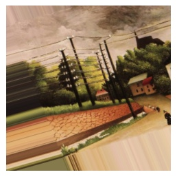
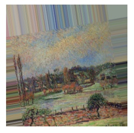

# Projecto final: Arte

Mar Lizana Atienza

*Data Part Time Barcelona Dic 2019*

## Content

**Índice**   
1. [Project Description](#id1)
2. [Dataset](#id2)
3. [Workflow](#id3)
4. [Results](#id4)
5. [Bibliografía](#id5)

## Project Description

Mediante la aplicación de técnicas de deep-learning entrenaré un algoritmo capaz de identificar los autores de obras de arte. Los motivos principales de la selección de este tema era poder trabajar con imágenes y redes neuronales.

## Dataset

Hemos seleccionado un dataset de la plataforma Kaggle sobre <a href="https://www.kaggle.com/ikarus777/best-artworks-of-all-time">los 50 artistas más influyentes</a> de la historia del arte. Se trata de una colección de imágenes de las obras de arte y un conjunto de datos con información básica recuperada de wikipedia en formato CSV. 

* **artists.csv**:

<CODE> id </CODE>: Identificador del artista.

<CODE> name </CODE> : Nombre del artista.

<CODE>years</CODE> : Año de nacimiento y defunción del artista.

<CODE>genre</CODE> : Movimiento/s en el que se le incluye.

<CODE>nationality</CODE> : Nacionalidad.

<CODE>bio</CODE> : Biografía.

<CODE>wikipedia</CODE> : URL a la entrada de Wikipedia.

<CODE>paintings</CODE> : número total de pinturas adjuntadas.
    

* **images.zip**:
    Colección de 8446 imágenes de cuadros de 50 artistas.
    
    
* **resized.zip**:
    Subset con imágenes de menor calidad para que los modelos vayan mejor.

## Workflow

El recorrido del proyecto es el siguiente:

1. [Análisis del proyecto](#id6)
2. [EDA](#id7)
3. [Data Wrangling](#id8)
4. [Elegir un modelo](#id9)
5. [Fine Tuning](#id10)
6. [Sistema de recomendación(EXTRA)](#id111)

### Análisis del proyecto

Nos encontramos frente a un problema que necesita de un algoritmo de aprendizaje supervisado.El trabajar con datos que requieren una capacidad computacional superior a mi ordenador requería de los servicios que ofrece Google en la nube. Cree dos máquinas virtuales, la primera con 30 GB de memoria y una GPU NVIDIA K80 y una segunda con 60 GB de memoria.

### EDA

Para el **análisis exploratorios de los datos** empecé trabajando con el csv. generé un grafo que me permitiera ver las relaciones entre los pintores através de los movimientos artísticos.

Generé una primera visualización de las imágenes. Aplicando la función <code>open_images_names</code> obtendremos las imágenes a analizar junto a una lista con los nombres que se extraen del archivo, y solo habrá que pasarle la dirección del directorio donde están nuestras imagenes junto con <k>/**</k> para que extraiga todos los archivos que hay dentro.

Con la función <code>muestra</code> podemos ver una imagen al azar de nuestra colección junto al nombre del artista y el tamaño. Cada vez que se ejecute saldrá una diferente.

Podemos observar por ejemplo que disponemos de más de 800 cuadros de Van Gogh, frente a unos 50 de Cezanne. Hay diferentes estrategias que podemos seguir para corregir este problema:

* Empezaremos probando con una selección de artistas que tengan el número de obras más balanceadas. Primero con una selección de los 5 pintores con más registros para luego ir ampliando.

### Separar *train*,*test* y *validation*

Generamos nuestra *X* y nuestra *y* desde la selección realizada en el paso anterior, almacenamos el número total de elementos de nuestra variable dependiente, aplicamos la función <code>LabelEncoder()</code> para codificar las etiquetas, creo un diccionario al que después recurrir para las visualizaciones y una lista solo con las etiquetas.Procedemos a separar el conjunto de entreno, test y validación y creamos una secuencia de 0 y 1 para nuestra variable dependiente.

### Data Wrangling

#### Ajustar el tamaño de las imágenes

Las imágenes que forman nuestra colección tienen diferentes tamaños; deberemos establecer un tamaño común para poder entrenar nuestro algoritmo. En este caso, limitaremos el tamaño a una dimensión de 100px para que los modelos puedan ejecutarse más rápido. Usaremos la función creada <code>resize_data</code> para ello.

Claramente la imagen a perdido bastante calidad, veamos como reaccionan los modelos.

#### DataAugmentation

Ahora estableceremos los parámetros para la creación de nuevas imagenes a partir de modificaciones de la original. Estas variaciones permiten aprovechar cada parte de la imagen para encontrar los patrones, lo cual es muy útil cuando tenemos pocas imágenes y para que el modelo generalice mejor. Podemos realizar las siguientes modificaciones:
* **rotation_range**: Indica el numero maximo de grados que la imagen se puede inclinar.
* **width shift range, height shift range**: cambia de orientación los pixeles de algunas partes de la imagen.
* **shear_range**: Modifica algunas partes de la imagen modificando la orientación.
* **zoom_range**: Aplica un acercamiento a la imagen.
* **horizontal_flip**: Cambia la orientación de la imagen.
* **fill_mode**: Cuando a la imagen se le aplica una rotación cambia su aspecto, para mantener el mismo aspecto se tienen que rellenar los pixeles faltantes, con la opción nearest los pixeles cercanos se repiten para rellenar las areas faltantes.

### Elegir el modelo

1. [Algunas consideraciones previas](#id341)
2. [Hiperparámetros](#id342)
3. [Red Neuronal Simple](#id343)
4. [Redes Convolucionales](#id344)
5. [VGG16](#id345)
6. [DenseNET](#id346)
7. [InceptionResNetV2 con ImageNet](#id347)
8. [NasNET](#id348)

#### Algunas consideraciones previas

**¿Qué es una red neuronal?**

La idea principal que hay detrás de las **redes neuronales** es la de imitar el funcionamiento de las de los organismos vivos: un conjunto de neuronas conectadas entre sí que trabajan en conjunto. Con la experiencia, las neuronas van creando y reforzando ciertas conexiones para "aprender". La información de entrada atraviesa la neurona, donde se llevan a cabo determinadas operaciones, produciendo unos valores de salida.

Las redes neuronales son un modelo para encontrar esa combinación de parámetros y aplicarla al mismo tiempo. Una red ya entrenada se puede usar luego para hacer predicciones o clasificaciones con otros datos.

Antes de comenzar a probar modelos determinaremos nuestros objetivos en los resultados. Para ello definimos las métricas que nos indicarán si nuestro modelo está haciendo bien el trabajo, empezando por los indicadores:

**Métricas de evaluación del modelo**:

* **loss**: Compara y mide cuan bueno/malo fue el resultado de la predicción en relación con el resultado correcto. Cuanto más proximo a 0 sea, mejor, queremos que la divergencia entre el valor estima y el esperado sea lo más pequeña posible.

* **mse**: El *error cuadrático medio* (median standard error)es una función de coste. Se pueden utilizar métodos estadísticos formales para determinar la confianza del modelo entrenado. 

* **learning rate**: El valor adecuado de este hiperparámetro depende del problema en cuestión, suele denominarse también *step size*. En general, una buena regla es que si nuestro modelo de aprendizaje no funciona, disminuyamos la learning rate. Si sabemos que el gradiente de la función de loss es pequeño, entonces es seguro probar con learning rate que compensen el gradiente.

* **acurracy**: La exactitud mide el porcentaje de casos en los que el modelo ha acertado y no distingue entre tipos de errores. Es una medida que se debe interpretar con cuidado, ya que puede dar buenos resultados sin un buen modelo cuando las clases están desbalanceadas. En nuestro caso será una de las métricas que usemos dado que no es relevante si tenemos falsos negativos ni falsos positivos.

* **precision**: La precisión mide la **calidad** del modelo. Es el resultado de dividir los verdaderos positivos entre la suma de los verdaderos positivos y los falsos positivos.

* **recall**: La exhaustividad nos aporta información sobre la **cantidad** de elementos que es capaz de identificar. Es el número de resultante de dividir los verdaderos positivos entre la suma de los verdaderos positivos y los falsos negativos.
* **f1**: El Valor-F combina las medidas de precisión y recall en un solo valor, siendo el resultado de multiplicar por dos el producto de la precision y el recall entre la suma de los mismos.

#### Hiperparámetros

Los *hiperparámetros* se utilizan para describir la configuración del modelo. No se utilizan para modelar los datos directamente, pero influyen en la capacidad y características de aprendizaje del modelo. 

Las funciones <code>callback</code> son aquellas que se pasan a otra función como argumento y se ejecutan dentro de esta. Aplicaremos las siguientes:

* **EarlyStopping**: Para cuando la función de coste no mejore en un número dado de epochs. Nos ayudará reduciendo el **overfitting**. Para ello marcaremos <code>verbose</code> en 1, para saber el epoch en el que el modelo se ha parado. Con <code>patience</code> le indicamos cuantos epochs tienen que pasar para que el entrenamiento pare y con <code>min_delta</code> establecemos un incremento específico de la mejora para el error cuadrático.

* **ReduceLROnPlateau**: Si el entrenamiento no mejora tras unos epochs específicos, reduce el valor de learning rate del modelo, lo que normalmente supone una mejora del entrenamiento. Ahora bien, el mejor learning rate  en general es aquel que disminuye a medida que el modelo se acerca a una solución.

* **Batch**: Con el *bach* definimos el número de muestras para trabajar antes de actualizar los paramétros internos del modelo. Las predicciones se comparan con las variables de salidad esperadas y se calcula el error. A partir de este error el algoritmo se actualiza para mejorarse.

    * **Batch Gradient Descent**. Cuando el tamaño del bach es igual que el del conjunto de entrenamiento.
    * **Stochastic Gradient Descent**. Cuando el tamaño del bach es igual a 1.
    * **Mini-Batch Gradient Descent**. Cuando el tamaño del bach está entre uno y el tamaño del conjunto de entrenamient, los más frecuentes en tutoriales son de  32, 64 y 128.
    
    
* **Epoch**: Se trata de un hiperparámetro que define el número de veces que el algoritmo de aprendizaje funcionará sobre el conjunto de datos de entrenamiento. Cada muestra del conjunto de datos de entrenamiento tiene la "oportunidad" de actualizar los parámetros internos del modelo. Puede estar compuesto por uno o más *batches*. El número de *epochs* suele ser grande, lo que permite que el algoritmo se ejecute hasta que el error del modelo se minimice lo suficiente.

Llegado el momento de compilar nuestro modelo usaremos las función <code>.compile()</code> con los siguientes parámetros:

* Una **función de *loss*** es uno de los parámetros requeridos para cuantificar lo cercano que está una determinada red neuronal de su ideal mientras está en el proceso de entrenamiento. Definimos nuestra función de pérdida en <code>loss</code> entre las opciones:
    * <code>'categorical_crossentropy'</code> : Calcula la pérdida de crossentropy entre los artistas y las predicciones. Se usa cuando hay dos o más etiquetas. Necesita de una representación <code>OneHotEncoding</code>.
    * <code>'sparse_categorical_crossentropy'</code> : Calcula la pérdida de crossentropy entre los artistas y las predicciones. Se usa cuando hay dos o más etiquetas. Necesita de una representación <code>LabelEncoder</code>.

* El **optimizador** es otro de los argumentos que se requieren en el método de compile(). De forma general, podemos ver el proceso de aprendizaje como un problema de optimización global donde los parámetros (los pesos y los sesgos) se deben ajustar de tal manera que la función de *loss* presentada anteriormente se minimice. Para nuestro <code>optimizer</code> usaremos:
    * <code>'Adam'</code>: implementa el algoritmo Adam. Se trata de un método de descenso de gradiente estocástico que se basa en la estimación adaptativa. Se trara de un método computacionalmente eficiente, con pocos requisitos de memoria y adecuado para problemas con grandes cantidades de datos/parámetros.

En cuanto a nuestras métricas, en <code>metrics</code> nos centraremos, como hemos comentado más arriba, en el accuracy y el error cuadrático.

#### Red Neuronal Simple

Una red neuronal es un grupo interconectado de nodos de forma similar a las neuronas de un cerebro. Una red neuronal simple se caracteriza por tener un número de entradas y un número de salidas. Cada entrada tendrá un peso e influirá en la salida de la neurona.

##### Creamos la red

Empezaremos definiendo una red neuronal simple y junto con ella, algunos conceptos que se irán repitiendo a medida que vayamos viendo diferentes modelos:
* **Sequential()**: Agrupa de forma lineal las capas del modelo proporcionando características de capacitación e inferencia al modelo.
* **Flatten**: Convierte la matriz de entrada en un array de 1 dimensión (plano).
* **Dense**: Añade una capa oculta a la red neuronal.

* **Función de activación ReLu**: Transforma los valores introducidos anulando los valores negativos y dejando los positivos tal y como entran. La ventaja de usar la función ReLU radica en que tiene un comportamiento lineal para entradas positivas, lo que evita precisamente este "estancamiento" durante el entrenamiento. Se activa un solo nodo si la entrada está por encima de cierto umbral.

* **Función de salida SoftMax**: Ha resultado dar buenos resultados cuando el entrenamiento es multietiqueta pero no multiclase, tenemos muchos artistas diferentes pero todos son pintores. Asigna probabilidades decimales a cada clase en un caso de clases múltiples de manera que terminen sumando 1. Esta restricción adicional permite que el entrenamiento converja más rápido.

Compilamos el modelo creado y le pasamos los parámetros para la función de pérdida, el optimizador y las métricas a tener en cuenta.
Con <code>.summary()</code> podemos ver un resumen de nuestra red neuronal. Esta red calculo algo más de **3 millones** de parámetros.

##### Entrenar el modelo

Ahora ya solo queda entrenarla, para lo cual le indicamos nuestras imágenes, los pintores y los parámetros que hemos establecido antes. Usaremos la función <code>.fit_generator()</code> en lugar de <code>.fit()</code> dado que nos permite llamar a las características que hemos establecido antes con <code>ImageDataGenerator</code> para aumentar el número de imágenes a analizar con pequeñas modificaciones.

Este modelo ha necesitado 11 *epochs* de los 100 establecidos al principio, al no pararse por la función de <code>EarlyStopping</code>. Podríamos concluir que para llegar a los resultados óptimos deberíamos aumentar este valor. Cada uno ha tardado uno 4 segundos, lo que ha hecho que el modelo tarde algo menos de **1 minuto** en total.

##### Evaluación del modelo

La función <code>.evaluate_generator()</code> nos permite las métricas *loss*, *accuracy* y *mse* que obtiene el modelo. Con estos primeros datos podemos ver como el coportamiento final de todos los parámetros es más que aceptable para una red neuronal simple. Tenemos un *loss* de 0,99, lo que indica un coste de computación alto, la *accuracy* no está mal tampoco, algo más de la mitad de los casos acierta y vemos que el *mse* también es una cifrá relativamente baja.Estas métricas comparan el conjunto de test con el de valiación, habrá que ver las métricas definitivas cuando las comparemos con el conjunto de test.

Con la función creada <code>plot_train_vs_test()</code> podemos ver el comportamiento de las métricas a lo largo de los *epochs*. Podemos observar en la gráfica de *accuracy* como el modelo parece que tiene una tendencia a seguir aumentando este parámetro con un mayor número de *epochs*. Mientras que en el gráfico de la función de pérdida vemos como el valor desciende muy rápido al principio para estancarse a partir de los 11 *epochs*.

##### Predicción del modelo

Una vez entrenado el modelo procedemos a ver los resultados que obtenemos con el conjunto de datos de test. Para ello empezaremos observando la matriz de confusión donde se pueden apreciar las etiquetas reales, eje de las abscisas, frente a las predichas, eje de las ordenadas. Podemos observar que el comportamiento y la capacidad de predicción no es del todo mala.

Las etiquetas de *Vincent Van Gogh* y *Albrecht Dürer* son las que clasifica mejor, también son las que tienen un mayor número de observaciones. Acabamos obteniendo un 51% de *accuracy* al pasarle nuestro conjunto de test.

Presenta problemas al identificar a *Renoir* como podemos ver en el <code>classification_report</code> y al pasarle la función <code>test_img</code>.

##### Conclusiones

Para tratarse de una red neuronal simple ha dado mejores resultados de los esperados, veremos como se comportan el resto de redes para poder comparar y sacar mejores conclusiones en relación a los resultados obtenidos.

#### Redes Convolucionales

Las neuronas de las redes neuronales convolucionales corresponden a campos receptivos de las neuronas de la corteza visual de un cerebro biológico. Han demostrado ser buenas para reconocer objetos en una imagen dado que permiten aprovecharla por trozos. Contiene varias capas ocultas especializadas que detectan de forma jerarquica, primero lineas y se van especializando hasta poder reconocer formas concretas.
Las **convoluciones** consisten en tomar grupos de píxeles próximos y operar entre ellos generando una pequeña matriz que se denomina *kernel*. Este *kernel* recorre la imagen generando nuevas matrices, que, a su vez, volverían a pasar por el proceso de convolución para finalmente obtener un mapa de detección de características.

##### Crear la red

En este caso veremos los siguientes conceptor nuevos:

* **Conv2D**: Introduce una red convolucional, esta realiza el proceso de mover el kernel por toda la imagen y multiplicar los valores que encuentra. Tenemos que indicarle como primer parámetro el número de kernels, después el tamaño de estos, el tamaño del input y el tipo de activación que queremos.
* **MaxPooling2D**: Para esta capa pasamos un kernel, pero en vez de multiplicar la información, toma el valor más grande de la sección de la imagen haciendo uns sintetización de los kernels anteriores para que no crezca exponencialmente el número de neuronas necesarias en la próxima capa. Con <code>pool_size</code> le indicamos el tamaño del kernel que usará esta capa.
* **Dropout**: Nos permite hacer redes con más capas.

Seguiremos el mismo proceso y estructura que con el modelo anterior.
Vemos como esta red neuronal propone entrenar más de **47 millones de parámetros** frente a los 3 millones de la red simple.

##### Entrenar el modelo

Este modelo ha necesitado **11 *epochs*** de los 100 establecidos al principio, la función de <code>EarlyStopping</code> ha parado el entreno por no haber cambios significativos en las métricas. Cada uno ha tardado alrededor de 9 segundos, lo que ha hecho que el modelo tarde **1 minuto y medio** en ejecutarse.

##### Evaluación del modelo

Con estos primeros datos podemos ver como el coportamiento final de todos los parámetros ha mejorado en relación al modelo anterior. Tenemos un *loss* de 1,26, lo que indica un coste alto, la *accuracy* mejora ligeramente empezando a ver se aceptable  y vemos que el *mse* también es una cifrá que ha mejorado. Como he comentado anteriormente, estas métricas sufriran modificaciones al usar el modelo con el conjunto de test.

Podemos observar en la gráfica de *accuracy* como el modelo parece que tiene una tendencia a seguir aumentando este parámetro pero se para dado que la función de pérdida no mejora. 

##### Predicción del modelo

Este modelo presenta unas métricas ligeramente inferiores a la **Red Neuronal Simple**. Podemos ver un sesgo hacia *Van Gogh* que puede venir dado por el desbalanceo.

La imagen de prueba no la clasifica bien, confunde a *Degas* con *Picasso*.

##### Conclusiones

La arquitectura de la **red neuronal simple** nos está dando mejores resultados a nivel de *accuracy*, veamos como se comportan las redes preentrenadas con nuestro conjunto de imágenes.

#### VGG-16

La red **VGG16** es una de las primeras redes neuronales profundas. Se trata de una **red convolucional preentrenada** con una arquitectura fácil de comprender y con 13 capas convolucionales y 3 densas, de ahí el nombre. Esta red fue entrenada para resolver un problema de clasificación de 1000 clases.

##### Crear la red

Seguimos los mismos casos que con los modelos anteriores. Para este caso tendremos en cuenta los siguientes parámetros:
* **include_top**: añade una red neuronal densa al final.
* **weights**: no cargaremos ningún modelo concreto preentrenado previamente como si haremos más adelante.
* **input_tensor**:no especificaremos ningún tensor de keras.
* **input_shape**:define la dimensión de los datos de entrada.
* **pooling**: no lo especificamos.
* **classes**: le indicamos el número de clases.

Tenemos más de **50 millones de parámetros** para entrenar. Frente a los 3 millones de nuestra red neuronal simple o los 47 de la red convolucional.

##### Entrenar el modelo

En este caso nos encontramos con un tiempo de espera de **8/9 segundos** por *epoch*, con un total de 15 *epochs*, lo que hacen poco más de 2 minutos. La función <code>EarlyStopping</code> ha parado el entreno.

##### Evaluación del modelo

Con las gráficas de evolución podemos observar como este modelo parece "no aprender" bien. El *accuracy* se comporta de forma errática y el *loss* parece ir bien encaminado en el primer *epoch* pero luego se mantiene con altibajos. Los resultados finales no acompañan.

##### Predicción del modelo

Al compararlo con nuestras imágenes de test vemos como, efectivamente, el modelo se ha comportado de forma errática. Obteniendo un 18% de *accuracy* una cifra bastante baja.

La imagen aleatoria de nuestro conjunto de test no la clasifica bien.

##### Conclusiones

Como podemos observar usar una red preentrenada sin ajustar no da muy buenos resultados.

#### DenseNet121

Una de las principales mejoras que prensenta **DenseNet** es que consiguó acortar las conexiones entre capas cercanas a la entrada y la salida, aumentando así la densidad de la red. Se trata de una red recursiva donde todas las capas están conectadas entre ellas y por lo tanto, cada capa utiliza los datos de las demás.

##### Crear la red
##### Entrenar el modelo
##### Evaluación del modelo
##### Predicción del modelo
##### Conclusiones

#### InceptionResNETV2 con ImageNet

En este caso usaremos la red pre-entrenada *IncepcionResNetV2* con  *ImageNet*. Se trata de una red convolucional que se ha entrenado con más de un millón de imagenes de *ImageNet*. *ImageNet* es un proyecto que proporciona una gran base de datos de imágenes con sus correspondientes anotaciones indicando el contenido de las imágenes. 

##### Crear la red

A destacar el parámetro <code>include_top=False</code>. Este parámetro le indica a la red que no debe incluir la última capa de la red, destinada a realizar la predicción final. Esta capa está preparada para realizar las predicciones de todas las clases de ImageNet. Como nosotros queremos predecir únicamente nuestras clases, sustituremos esta capa por una capa personalizada.

Necesitamos usar una capa <code>GlobalAveragePooling2D</code> para adaptar la salida de la capa anterior a la capa *softmax*.

A la función de creación de la red deberemos pasarle el parámetro <code>layers</code> que determina las capas del modelo a congelar. Tendremos que hacer varias pruebas hasta encontrar un numero de capas a congelar adecuado. 

##### Entrenar el modelo
##### Evaluación del modelo
##### Predicción del modelo
##### Conclusiones

#### NasNET

##### Crear la red
##### Entrenar el modelo
##### Evaluación del modelo
##### Predicción del modelo
##### Conclusiones

### Fine Tuning

### Sistema de recomendación(EXTRA)

## Results

## Bibliografía

* Evans, O. (2019). Sensory Optimization: Neural Networks as a Model for Understanding and Creating Art. Recuperado de https://owainevans.github.io/visual_aesthetics/sensory-optimization.html

* Utrera Brugal, Jesús (2019). Tratamiento de imágenes usando ImageDataGenerator en Keras. Recuperado de https://enmilocalfunciona.io/author/jesus/

* Lerch, Daniel (2018). Fine-tuning en reconocimiento de imágenes mediante Deep Learning. Recuperado de https://medium.com/neuron4/fine-tuning-en-reconocimiento-de-im%C3%A1genes-mediante-deep-learning-c656ae728d73

