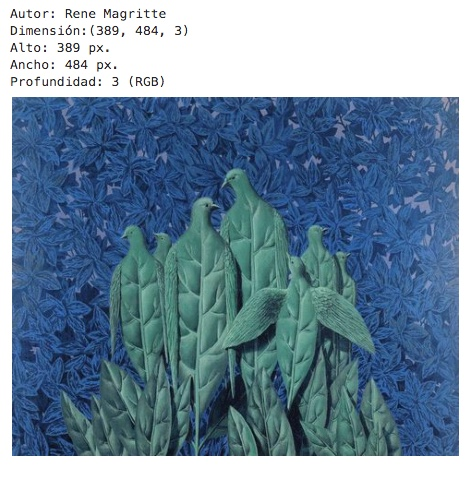
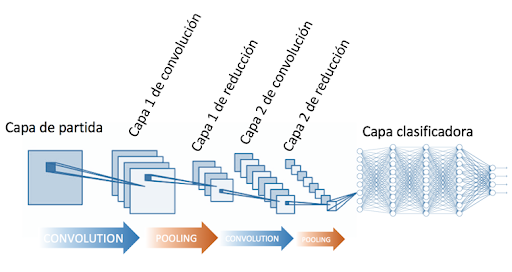
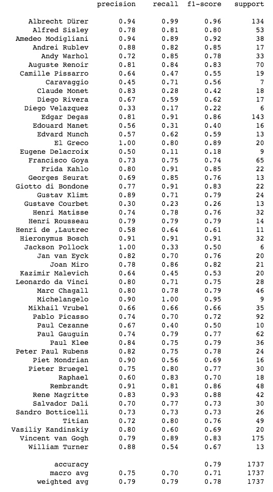

# Projecto final: Arte

Mar Lizana Atienza

*Data Part Time Barcelona Dic 2019*

## Contenido

**Índice**   
1. [Descripción del proyecto](#id1)
2. [Dataset](#id2)
3. [Workflow](#id3)
4. [Conclusiones y próximos pasos](#id111)
5. [Bibliografía](#id5)

## Descripción del proyecton

Mediante la aplicación de técnicas de deep-learning he entrenado un algoritmo capaz de identificar autores de obras de arte. El principal motivo para la elección del tema es que permite trabajar con imágenes y redes neuronales.

## Dataset

He seleccionado un dataset de la plataforma Kaggle sobre <a href="https://www.kaggle.com/ikarus777/best-artworks-of-all-time">los 50 artistas más influyentes</a> de la historia del arte. Se trata de una colección de imágenes de las obras e información recuperada de wikipedia en formato CSV. 

* **artists.csv**:

<CODE> id </CODE>: Identificador del artista.

<CODE> name </CODE> : Nombre del artista.

<CODE>years</CODE> : Año de nacimiento y defunción del artista.

<CODE>genre</CODE> : Movimiento/s en el que se le incluye.

<CODE>nationality</CODE> : Nacionalidad.

<CODE>bio</CODE> : Biografía.

<CODE>wikipedia</CODE> : URL a la entrada de Wikipedia.

<CODE>paintings</CODE> : Número total de pinturas adjuntadas.
    

* **images.zip**:
    Colección de 8446 imágenes de cuadros de 50 artistas.
    
    
* **resized.zip**:
    Subset con imágenes de menor calidad para facilitar el funcionamiento de los modelos.

## Workflow

El recorrido del proyecto es el siguiente:

1. [Análisis del proyecto](#id6)
2. [EDA](#id7)
4. [Separar *train*,*test* y *validation*](#id77)
5. [Data Wrangling](#id8)
6. [Elegir un modelo](#id9)
7. [Fine Tuning](#id10)

### Análisis del proyecto

Este trabajo requiere un algoritmo de aprendizaje supervisado. La capacidad computacional necesaria para procesar todos los datos es superior a la de mi ordenador personal, por lo que he hecho uso los servicios que ofrece Google en la nube. Creé dos máquinas virtuales, la primera con 30 GB de memoria y una GPU NVIDIA K80, y la segunda con 60 GB de memoria.

### EDA

Para el **análisis exploratorio de los datos** empecé trabajando con el csv. Generé un grafo que me permitiese ver las relaciones entre pintores a través de los movimientos artísticos.

Esta es una primera visualización de las imágenes. Con la función <code>open_images_names</code> se obtienen las imágenes a analizar junto a una lista de los nombres que se extraen del archivo. Para extraer los archivos solo habrá que indicar el directorio donde están nuestras imágenes junto con <k>/**</k>.

La función <code>muestra</code> permite ver una imagen al azar de nuestra colección junto al nombre del artista y el tamaño. Cada vez que se ejecute saldrá una diferente.

Enseguida se observa un problema de desbalanceo. Por ejemplo, disponemos de más de 800 cuadros de Van Gogh, frente a unos 50 de Cezanne. Hay diferentes formas de corregir esto.

* Empezaremos con una selección de artistas con número de obras más cercano entre sí, partiendo de los 5 pintores con más registros para luego ir ampliando.

### Separar *train*,*test* y *validation*

Ahora podemos generar nuestra *X* y nuestra *y* desde la selección realizada en el paso anterior, paa a continuación almacenar el número total de elementos de la variable dependiente, aplicar la función <code>LabelEncoder()</code> para codificar las etiquetas, y crear un diccionario al que después recurrir para las visualizaciones, así como una lista con las etiquetas. A partir de aquí se puede separar el conjunto de entreno, test y validación y crear una secuencia de 0 y 1 para la variable dependiente.

### Data Wrangling

#### Ajustar el tamaño de las imágenes

Las imágenes que forman la colección tienen diferentes tamaños; habrá que establecer un tamaño común para poder entrenar el algoritmo. En este caso, limitando el tamaño a una dimensión de 100px para que los modelos puedan ejecutarse más rápido, mediante la función <code>resize_data</code>.

Claramente la imagen ha perdido bastante calidad. Veamos cómo reaccionan los modelos.

#### DataAugmentation

Ahora se pueden establecer parámetros para la creación de nuevas imágenes a partir de modificaciones de la original. Estas variaciones permiten aprovechar cada parte de la imagen para encontrar patrones, lo cual es muy útil cuando hay pocas imágenes y hará que el modelo generalice mejor.
* **rotation_range**: Número máximo de grados que la imagen se puede inclinar.
* **width shift range, height shift range**: Cambia de orientación los píxeles de algunas partes de la imagen.
* **shear_range**: Modifica algunas partes de la imagen manipulando la orientación.
* **zoom_range**: Aplica un acercamiento a la imagen.
* **horizontal_flip**: Cambia la orientación de la imagen.
* **fill_mode**: Los píxeles cercanos se repiten para rellenar las áreas que una rotación haya podido dejar vacías.

### Elegir el modelo

1. [Algunas consideraciones previas](#id341)
2. [Hiperparámetros](#id342)
3. [Red Neuronal Simple](#id343)
4. [Redes Convolucionales](#id344)
5. [VGG16](#id345)
6. [DenseNET](#id346)
7. [InceptionResNetV2 con ImageNet](#id347)
8. [NasNET](#id348)

#### Algunas consideraciones previas

**¿Qué es una red neuronal?**

La idea principal que hay detrás de las **redes neuronales** es la de imitar el funcionamiento de las de los organismos vivos: un conjunto de neuronas conectadas entre sí que trabajan en conjunto. Con la experiencia, las neuronas van creando y reforzando ciertas conexiones para "aprender". La información de entrada atraviesa la neurona, donde se llevan a cabo determinadas operaciones, produciendo unos valores de salida.

Las redes neuronales son un modelo para encontrar esa combinación de parámetros y aplicarla al mismo tiempo. Una red ya entrenada se puede usar luego para hacer predicciones o clasificaciones con otros datos.

Antes de comenzar a probar modelos habrá que determinar objetivos en los resultados. Para ello son útiles las métricas que indicarán si el modelo está haciendo bien el trabajo, empezando por los indicadores:

**Métricas de evaluación del modelo**:

* **loss**: Compara el resultado predicho con el resultado correcto. Cuanto más próximo a 0 mejor, ya que se busca la menor divergencia posible.

* **mse**: El *error cuadrático medio* (median standard error) es una función de coste. Se pueden utilizar métodos estadísticos formales para determinar la confianza del modelo entrenado. 

* **learning rate**: El valor adecuado de este hiperparámetro depende del problema en cuestión. En general, si el modelo de aprendizaje no funciona, es buena idea reducir la learning rate. Si el gradiente de la función de loss es pequeño, se pueden probar learning rate que compensen el gradiente.

* **acurracy**: Porcentaje de casos en que el modelo ha acertado. No distingue entre tipos de errores. Debe interpretarse con cuidado, ya que un mal modelo puede dar buenos resultados cuando las clases están desbalanceadas. En este proyecto será muy útil dado que no son relevantes los falsos negativos ni los falsos positivos.

* **precision**: Mide la **calidad** del modelo. Es el resultado de dividir verdaderos positivos entre la suma de verdaderos positivos y falsos positivos.

* **recall**: Aporta información sobre la **cantidad** de elementos que es capaz de identificar. Es el resultado de dividir verdaderos positivos entre la suma de verdaderos positivos y falsos negativos.
* **f1**: El Valor-F combina precision y recall en un solo valor, siendo el resultado de multiplicar por dos el producto de la precision y el recall entre la suma de los mismos.

Mediremos la eficacia del modelo con la *accuracy*.

#### Hiperparámetros

Los **hiperparámetros** se utilizan para describir la configuración del modelo. No se utilizan para modelar los datos directamente, pero influyen en la capacidad y características de aprendizaje del modelo. 

Las funciones <code>callback</code> son aquellas que se pasan a otra función como argumento y se ejecutan dentro de esta. En este proyecto se aplicarán las siguientes:

* **EarlyStopping**: Para cuando la función de coste no mejore en un número dado de epochs. Ayudará reduciendo el **overfitting**. Para ello se marca <code>verbose</code> en 1, para saber el epoch en el que el modelo se ha parado. Con <code>patience</code> se indicará cuántos epochs tienen que pasar para que el entrenamiento pare y con <code>min_delta</code> se establece un incremento específico de mejora para el error cuadrático.

* **ReduceLROnPlateau**: Si el entrenamiento no mejora tras unos epochs específicos, reduce el valor de learning rate del modelo, lo que normalmente supone una mejora del entrenamiento. Ahora bien, el mejor learning rate suele ser aquel que disminuye a medida que el modelo se acerca a una solución.

* **Batch**: Define el número de muestras para trabajar antes de actualizar los paramétros internos del modelo. Las predicciones se comparan con las variables de salidad esperadas y se calcula el error. A partir de este error el algoritmo se actualiza para mejorarse.

    * **Batch Gradient Descent**. Cuando el tamaño del bach es igual que el del conjunto de entrenamiento.
    * **Stochastic Gradient Descent**. Cuando el tamaño del bach es igual a 1.
    * **Mini-Batch Gradient Descent**. Cuando el tamaño del bach está entre uno y el tamaño del conjunto de entrenamiento.
    
    
* **Epoch**: Se trata de un hiperparámetro que define el número de veces que el algoritmo de aprendizaje funcionará sobre el conjunto de datos de entrenamiento. Cada muestra del conjunto de datos de entrenamiento tiene la "oportunidad" de actualizar los parámetros internos del modelo. Puede estar compuesto por uno o más *batches*. El número de *epochs* suele ser grande, lo que permite que el algoritmo se ejecute hasta que el error del modelo se minimice lo suficiente.

Llegado el momento de compilar nuestro modelo usaremos la función <code>.compile()</code> con los siguientes parámetros:

* Una **función de *loss*** es un parámetro requerido para cuantificar lo cerca que está una red neuronal de su ideal durante el proceso de entrenamiento. Definimos nuestra función de pérdida en <code>loss</code> entre las opciones:
    * <code>'categorical_crossentropy'</code> : Calcula la pérdida de crossentropy entre los artistas y las predicciones. Se usa cuando hay dos o más etiquetas. Necesita de una representación <code>OneHotEncoding</code>.
    * <code>'sparse_categorical_crossentropy'</code> : Calcula la pérdida de crossentropy entre los artistas y las predicciones. Se usa cuando hay dos o más etiquetas. Necesita de una representación <code>LabelEncoder</code>.

* El **optimizador** es otro argumentos requerido en el método de compile(). El proceso de aprendizaje es un problema de optimización global donde los parámetros (pesos y sesgos) se deben ajustar de manera que la función de *loss* se minimice. Para el <code>optimizer</code> se usará:
    * <code>'Adam'</code>: implementa el algoritmo Adam. Se trata de un método de descenso de gradiente estocástico basado en la estimación adaptativa. Es computacionalmente eficiente, con pocos requisitos de memoria y adecuado para problemas con grandes cantidades de datos/parámetros.

En cuanto a métricas, en <code>metrics</code> utilizaremos *accuracy* y error cuadrático.

#### Red Neuronal Simple

Una red neuronal es un grupo de nodos interconectado de forma similar a las neuronas de un cerebro. Una red neuronal simple se caracteriza por tener un número de entradas y un número de salidas. Cada entrada tendrá un peso e influirá en la salida de la neurona.

##### Creando la red

Empecemos definiendo una red neuronal simple y algunos conceptos que se irán repitiendo a medida que aparezcan diferentes modelos:
* **Sequential()**: Agrupa de forma lineal las capas del modelo proporcionando características de capacitación e inferencia al modelo.
* **Flatten**: Convierte la matriz de entrada en un array de 1 dimensión (plano).
* **Dense**: Añade una capa oculta a la red neuronal.

* **Función de activación ReLu**: Anula los valores negativos y deja los positivos tal y como entran. Su ventaja radica en que tiene un comportamiento lineal para entradas positivas, lo que evita el "estancamiento" durante el entrenamiento. Se activa un solo nodo si la entrada está por encima de cierto umbral.

* **Función de salida SoftMax**: Da buenos resultados cuando el entrenamiento es multietiqueta pero no multiclase (hay muchos artistas diferentes pero todos son pintores). Asigna probabilidades decimales a cada clase en un caso de clases múltiples, de manera que terminen sumando 1. Esta restricción adicional permite que el entrenamiento converja más rápido.

Llegado este punto, se compila el modelo creado y se le pasan los parámetros para la función de pérdida, el optimizador y las métricas a tener en cuenta.
Con <code>.summary()</code> se puede ver un resumen de la red neuronal. Esta red calculó algo más de **3 millones** de parámetros.

##### Entrenar el modelo

Ya solo queda entrenarla, para lo cual se le indican imágenes, pintores y parámetros establecidos previamente. Se usará la función <code>.fit_generator()</code> en lugar de <code>.fit()</code>, dado que permite llamar a las características que establecidas antes con <code>ImageDataGenerator</code> para aumentar el número de imágenes a analizar con pequeñas modificaciones.

Este modelo ha necesitado 11 *epochs* de los 100 establecidos al principio, al no pararse por la función de <code>EarlyStopping</code>. Podríamos concluir que para llegar a los resultados óptimos deberíamos aumentar este valor. Cada uno ha tardado uno 4 segundos, lo que ha hecho que el modelo tarde algo menos de **1 minuto** en total.

##### Evaluación del modelo

La función <code>.evaluate_generator()</code> muestra las métricas *loss*, *accuracy* y *mse* que obtiene el modelo. Con estos primeros datos podemos ver cómo el comportamiento final de todos los parámetros es más que aceptable para una red neuronal simple. El *loss* es de 0.99, lo que indica un coste de computación alto; la *accuracy* es también aceptable, con algo más de la mitad de los casos acertados, y el *mse* es una cifrá relativamente baja. Estas métricas comparan el conjunto de test con el de validación, habrá que ver las métricas definitivas cuando las comparemos con el conjunto de test.

La función <code>plot_train_vs_test()</code> muestra el comportamiento de las métricas a lo largo de los *epochs*. Se puede observar en la gráfica de *accuracy* la aparente tendencia del modelo a seguir aumentando este parámetro a mayor número de *epochs*. En el gráfico de la función de pérdida vemos cómo el valor desciende rápidamente al principio para estancarse a partir de los 11 *epochs*.

##### Predicción del modelo

Una vez entrenado el modelo es posible consultar los resultados que obtenemos con el conjunto de datos de test. Una forma de hacerlo es mediante la matriz de confusión, donde se pueden apreciar las etiquetas reales (abscisas), frente a las predichas (ordenadas). El comportamiento y la capacidad de predicción son aceptables.

Las etiquetas de *Vincent Van Gogh* y *Albrecht Dürer* son las mejor clasificadas, y las que tienen mayor número de observaciones. Se obtiene así un 53% de *accuracy* al pasarle el conjunto de test.

Presenta problemas al identificar a *Renoir* como podemos ver en el <code>classification_report</code>.

##### Conclusiones

Tratándose de una red neuronal simple podemos considerar que ha dado muy buenos resultados. A continuación analizaremos el comportamiento del resto de redes para comparar y sacar mejores conclusiones.

#### Redes Convolucionales

Las neuronas de las redes neuronales convolucionales corresponden a campos receptivos de las neuronas de la corteza visual de un cerebro biológico. Han demostrado ser buenas para reconocer objetos en una imagen dado que permiten aprovecharla por partes. Contienen varias capas ocultas especializadas que detectan de forma jerarquica, partiendo de líneas para especializarse hasta poder reconocer formas concretas.

Las **convoluciones** consisten en tomar grupos de píxeles próximos y operar entre ellos generando una pequeña matriz o *kernel*. Este *kernel* recorre la imagen generando nuevas matrices, que, a su vez, vuelven a pasar por el proceso de convolución para finalmente obtener un mapa de detección de características.

##### Crear la red

En este caso veremos los siguientes conceptos nuevos:

* **Conv2D**: Introduce una red convolucional, esta realiza el proceso de mover el kernel por toda la imagen y multiplicar los valores que encuentra. Habrá que indicarle como primer parámetro el número de kernels, después el tamaño de estos, el tamaño del input y el tipo de activación que queremos.
* **MaxPooling2D**: Para esta capa se pasa un kernel, pero en vez de multiplicar la información, toma el valor más grande de la sección de la imagen haciendo una sintetización de los kernels anteriores, para que no crezca exponencialmente el número de neuronas necesarias en la próxima capa. Con <code>pool_size</code> se indica el tamaño del kernel que usará esta capa.
* **Dropout**: Permite hacer redes con más capas.

Se seguirá el mismo proceso y estructura del modelo anterior.
Esta red neuronal propone entrenar más de **47 millones de parámetros**, frente a los 3 millones de la red simple.

##### Entrenar el modelo

Este modelo ha necesitado **11 *epochs*** de los 100 establecidos al principio, la función de <code>EarlyStopping</code> ha parado el entreno por no haber cambios significativos en las métricas. Cada uno ha tardado alrededor de 9 segundos, lo que ha hecho que el modelo tarde **1 minuto y medio** en ejecutarse.

##### Evaluación del modelo

Con estos primeros datos ya es visible la mejora en el coportamiento final de todos los parámetros respecto al modelo anterior. El *loss* es de 1.006, lo que indica un coste alto, la *accuracy* mejora ligeramente empezando a verse aceptable. El *mse* también ha mejorado. Como se ha comentado anteriormente, estas métricas sufrirán modificaciones al usar el modelo con el conjunto de test.

Podemos observar en la gráfica de *accuracy* cómo el modelo parece que tiene una tendencia a seguir aumentando este parámetro pero se para dado que la función de pérdida no mejora. 

##### Predicción del modelo

Este modelo presenta unas métricas ligeramente inferiores a la **Red Neuronal Simple**. Podemos ver un sesgo hacia *Van Gogh* que puede venir dado por el desbalanceo.

La imagen de prueba no la clasifica bien, confunde a *Degas* con *Van Gogh*.

##### Conclusiones

La arquitectura de la **red neuronal simple** da mejores resultados en cuanto a *accuracy*. Queda compararla con el comportamiento de las redes preentrenadas con nuestro conjunto de imágenes.

#### VGG-16

La red **VGG16** es una de las primeras redes neuronales profundas. Se trata de una **red convolucional preentrenada** con una arquitectura fácil de comprender, con 13 capas convolucionales y 3 densas, de ahí el nombre. Esta red fue entrenada para resolver un problema de clasificación de 1000 clases.

##### Crear la red

Se sigue la misma estructura que con los modelos anteriores. Para este caso se tendrán en cuenta los siguientes parámetros:
* **include_top**: Añade una red neuronal densa al final.
* **weights**: No se cargarán modelos concretos preentrenados previamente hasta más adelante.
* **input_tensor**: No se especificará ningún tensor de keras.
* **input_shape**: Define la dimensión de los datos de entrada.
* **pooling**: No se especificará.
* **classes**: Indica el número de clases.

Presenta más de **50 millones de parámetros** para entrenar, frente a los 3 millones de la red neuronal simple o los 47 de la red convolucional.

##### Entrenar el modelo

En este caso el tiempo de espera es de **8/9 segundos** por *epoch*, con un total de 15 *epochs*, lo que hacen poco más de 2 minutos. La función <code>EarlyStopping</code> ha parado el entreno.

##### Evaluación del modelo

Con las gráficas de evolución se observa cómo este modelo parece no "aprender" bien. El *accuracy* se comporta de forma errática y el *loss* parece ir bien encaminado en el primer *epoch* pero luego se mantiene con altibajos. Los resultados finales no acompañan.

##### Predicción del modelo

Al compararlo con las imágenes de test vemos como, efectivamente, el modelo se comporta de forma errática, obteniendo un 18% de *accuracy*, una cifra bastante baja.

La imagen aleatoria del conjunto de test no la clasifica bien.

##### Conclusiones

Usar una red preentrenada sin ajustar no da buenos resultados. 

#### DenseNet121

Una de las principales mejoras que presenta **DenseNet** es que consiguó acortar las conexiones entre capas cercanas a la entrada y la salida, aumentando así la densidad de la red. Se trata de una red recursiva donde todas las capas están conectadas entre sí, y por tanto cada capa utiliza los datos de las demás.

Es la segunda que da peores resultados.

#### InceptionResNETV2 con ImageNet

En este caso se usará la red pre-entrenada *IncepcionResNetV2* con *ImageNet*. Se trata de una red convolucional que se ha entrenado con más de un millón de imagenes de *ImageNet*. *ImageNet* es un proyecto que proporciona una gran base de datos de imágenes con sus correspondientes anotaciones indicando el contenido de las imágenes. 

##### Crear la red

A destacar el parámetro <code>include_top=False</code>. Este indica a la red que no debe incluir la última capa, destinada a realizar la predicción final. Esta capa está preparada para realizar las predicciones de todas las clases de ImageNet. Como se busca predecir únicamente las clases, esta capa se sustituirá por una personalizada.

La capa <code>GlobalAveragePooling2D</code> adaptará la salida de la capa anterior a la capa *softmax*.

A la función de creación de la red debe pasársele primero el parámetro <code>layers</code> que determina las capas del modelo a congelar. Tendremos que hacer varias pruebas hasta encontrar un número de capas a congelar adecuado. 

##### Entrenar el modelo

El entreno se ha realizado en 52 *epochs* de 5 segundos, con un tiempo total de menos de **5 minutos**. La *accuracy* en relación al conjunto de validación es del 74%.

##### Evaluación del modelo

En el primer gráfico se presenta la *accuracy* obtenida en cada *epoch*, tanto para los datos de entrenamiento como los de test. En el segundo gráfico vemos la evolución en cada epoch de la *loss* para los dos conjuntos de datos. Estos son los mejores resultados hasta el momento.

##### Predicción del modelo

Consigue un 76% de *accuracy* frente al conjunto de test, siendo los 3 artistas más representados los que obtienen mejores métricas.

##### Conclusiones

Es, con diferencia, la red que de entrada da mejores resultados. Ha completado el entreno en poco tiempo y es la que obtiene mejores métricas en los artistas menos representados.

#### NasNET

Alrededor de noviembre de 2017 el proyecto AutoML de Google creó NASNet, un sistema optimizado para ImageNet. Fue entrenada para la identificación y reconocimiento de imágenes con más de 60.000 imágenes y 1000 categorías diferentes. Tiene un tamaño de entrada por defecto de 224 por 224. Puede dar una baja *accuracy* en datasets grandes.

##### Crear la red

Para crear esta red disponemos de varios parámetros de entrada:
*  <code>input_shape</code>: Al que se pasará el tamaño de las imágenes.
*  <code>include_top</code>: Incluye una capa conectada en la parte superior.
*  <code>weights</code>: Puede ser <code>None</code> o utilizar los pesos de *ImageNet*.
*  <code>input_tensor</code>: Tensor opcional de Keras.
*  <code>pooling</code>: Hace que el *output* del modelo sea un tensor 4D en la última capa convolucional.
*  <code>classes</code>: Número de clases a identificar.

##### Entrenar el modelo

Al entrenar el modelo vemos que se ha detenido en el *epoch* 37. A 16 segundos por *epoch* el tiempo de espera ha sido de algo menos de **10 minutos**. El resultado de *accuracy* con respecto a la muestra de validación es del 71%.

##### Evaluación del modelo

La función de pérdida y el error medio cuadrático presentan buenas cifras, que van descendiendo a lo largo del entreno. La *accuracy* también mejora hasta el *epoch* 30, donde se estanca en el conjunto de validación.

##### Predicción del modelo

La diagonal descendente en la matriz de confusión indica buenos resultados. El <code>classification_report</code> muestra cómo *Auguste Renoir* y *Pablo Picasso* son los peor clasificados; podría deberse a un menor soporte en el conjunto total de datos.

##### Conclusiones

La red *NasNET* tiene buenos resultados, pero un *accuracy* más bajo en un tiempo de ejecución más alto que *InceptionResNetV2*.

#### Comparativa de modelos y conclusiones generales

Se han analizado diversas redes, las dos primeras creadas desde 0, frente al uso de diferentes arquitecturas ya creadas, así como de pesos ya entrenados. 

Se ha demostrado que un mayor número de parámetros no implica mejores resultados. Esto se ve claramente en el caso de los *VGG16* y la red neuronal simple, la primera con más de 50 millones de parámetros y un *accuracy* del 33% frente a los 3 millones de parámetros y 55% de aciertos.

Los tiempos indicados son los obtenidos con la GPU NVIDIA K80, con la máquina virtual de 60 GB de memoria los modelos con más parámetros llegaron a tardar 12 horas.

En las siguientes gráficas se puede observar la evolución de las métricas de los modelos a lo largo del proceso de entreno. En la primera vemos como el ***accuracy*** de las redes *NasNet* e *InceptionResNetV2* con *ImageNet* son los que presentan una mejor evolución. La red neuronal simple y la convolucional las siguen con unos números bastante inferiores y parándose al no mejorar. Resulta llamativo el comportamiento estático de *DenseNet*, habría que revisar si este proceso ha sido llevado a cabo correctamente. Por último, la red *VGG16* es la que presenta peores resultados con diferencia.

### Fine Tuning

Una vez seleccionada la red con mejores resultados puede analizarse su comportamiento al congelar un número diferente de capas, así como al variar el número total de píxeles de la imagen a (250,250) y (300,300).

Cambiando el tamaño de imagen a (250,250) y manteniendo 700 capas congeladas se alcanza un *accuracy* de un **90%** en el conjunto de 5 artistas.

Aumentando a (300,300) el tamaño de la imagen y manteniendo el mismo número de capas se logra un **88%** de *accuracy*.

Con una calidad de (300, 300) px y congelando 600 capas en el conjunto total del *dataset* se obtiene un **79%**.

## Conclusiones y próximos pasos

Considero que los resultados son bastante buenos en general. Trabajar con redes neuronales e imágenes me ha gustado mucho y ha sido una buena toma de contacto para seguir formándome en ese campo.

Como principal conclusión extraería que las herramientas para *transfer-learning* pueden ser más que adecuadas para solucionar este tipo de problemas, ahorrando muchísimo tiempo y recursos.
El uso de plataformas que permiten la creación de máquinas virtuales con GPU ha acortado el tiempo de los entrenos, permitiendo completar este trabajo y probar más cosas. En mi ordenador hubiese sido imposible.

Como próximos pasos me gustaría añadir el movimiento artístico de las obras al output, con lo que se resolverían los posibles errores en obras de diferentes etapas de un pintor. También me gustaría crear un recomendador. El producto final permitiría, a partir de una imagen, obtener artista, movimiento al que pertenece la obra y una colección de 3 o 5 obras similares.

## Bibliografía

* Evans, O. (2019). Sensory Optimization: Neural Networks as a Model for Understanding and Creating Art. https://owainevans.github.io/visual_aesthetics/sensory-optimization.html

* Utrera Brugal, Jesús (2019). Tratamiento de imágenes usando ImageDataGenerator en Keras. https://enmilocalfunciona.io/author/jesus/

* Lerch, Daniel (2018). Fine-tuning en reconocimiento de imágenes mediante Deep Learning. https://medium.com/neuron4/fine-tuning-en-reconocimiento-de-im%C3%A1genes-mediante-deep-learning-c656ae728d73

*https://www.researchgate.net/publication/334279066_A_survey_on_Image_Data_Augmentation_for_Deep_Learning

